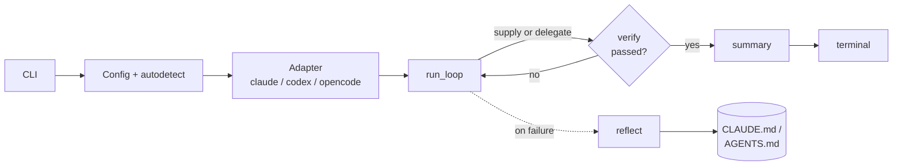

# looptight

**Your coding agent on autopilot, across Claude Code, Codex, and opencode, that gets smarter every run.**

looptight is a thin, portable learning layer for coding agents. It runs on the
agent you already have, drives the native loop where one exists, supplies one
where it doesn't, and makes every run teach the next.

Two things no single agent does today:

1. **One consistent interface across agents.** The same command works on Claude
   Code, Codex, and opencode. Switch agents without relearning anything.
2. **Durable lessons that compound.** Every failed-then-fixed run leaves a
   short, specific lesson in your agent's own memory file (`CLAUDE.md` /
   `AGENTS.md` / opencode config). Lessons survive across runs and across goals,
   and they keep working even when looptight isn't running.

It does not reinvent the loop. Where your agent already ships an eval-gated loop
(Claude Code's `/goal`), looptight drives it. Where it doesn't, looptight
supplies one. It builds on those loops instead of working around them.

## Quickstart (three lines)

```bash
uvx looptight init                       # writes a minimal config, explains `verify`
uvx looptight "fix the failing tests"    # runs your agent until verify passes
uvx looptight lessons                    # see what it learned for next time
```

No services. No DAG to author. No migration. If your repo has tests, you are
about 90 seconds from your first green loop.

> Prefer `pipx install looptight` or `pip install looptight` if you don't use
> [uv](https://github.com/astral-sh/uv).

## The one concept you have to learn: `verify`

`verify` is a command that decides pass/fail. No verify, no loop. That's the
whole mental model.

```toml
# .looptight.toml
verify = "pytest -q"      # exit 0 = pass; non-zero = keep going
```

`looptight init` auto-detects this from your project (`pytest`, `npm test`,
`go test`, `cargo test`, `make test`), so most repos need no config at all.
Everything else (the agent, the budget, the iteration cap) has a safe default
and is just an override.

For agent integrations and scripts, `looptight verify --json` returns the
versioned verdict `pass`, `fail`, `timeout`, or `error`. Only `pass` permits a
commit or successful continuation; a broken validator never looks like failing
code. Command exit codes are `0` for pass, `1` for a valid failure, and `2` for
configuration or validator-execution errors.

## What a run looks like

```
looptight · agent: claude (supplying loop) · verify: pytest -q · budget: $1.00

iteration 1 → verify: FAIL  (3 failing)   $0.04
iteration 2 → verify: FAIL  (1 failing)   $0.09
iteration 3 → verify: PASS                $0.13

✓ done in 3 iterations · $0.13 · lesson saved to CLAUDE.md
```

## How it works

The CLI loads your config, picks an adapter for the agent on your PATH, and
hands off to the loop. The loop either drives the agent's own loop (`--native`)
or supplies its own. Either way, looptight runs `verify` as the contract and
writes a lesson when a run hits a failure.



The full breakdown, including the supply-vs-delegate decision and the adapter
seam, is in [`docs/architecture.md`](docs/architecture.md).

## Why looptight

- **vs a single agent's native loop (Claude `/goal`):** not locked to one agent
  or one auth. It works on API-key or subscription auth, on all three agents,
  with one interface. It also adds compounding lessons that a per-thread goal
  primitive structurally can't. Where an agent has a native loop, looptight
  drives it (`--native`) instead of fighting it.
- **vs heavy frameworks (DAG/orchestration):** no graph to author, no migration.
  Runs on the agent you already have in under two minutes, and it's eval-gated,
  so it never loops pointlessly.
- **vs raw headless mode:** adds the learning, the safety rails (hard caps, a
  spend threshold, per-iteration git checkpoints), and one consistent interface. That's
  the part everyone otherwise hand-rolls badly.

## What this is / isn't

**It is:**
- A portability and learning layer above your coding agent.
- Eval-gated: the `verify` command is the ground-truth oracle.
- Safe by default: low iteration cap, a spend threshold that stops the loop
  (raise it with `--budget`), and a git checkpoint of tracked changes before
  every iteration so you can get your tracked edits back.

**It isn't:**
- A replacement for native loops. Where your agent has its own eval-gated loop,
  looptight drives it rather than replacing it.
- A multi-agent / DAG orchestrator.
- A web dashboard. Terminal output is more gif-able and zero-setup.
- A new model or a fine-tuner. It wraps the agent you already run.

## Supported agents

| Agent | Headless command | Native loop | Status |
|-------|------------------|-------------|--------|
| Claude Code (`claude`) | `claude -p` | `/goal`, drive it with `--native` | ✅ working |
| Codex (`codex`) | `codex exec` | supply (`/goal` is interactive and self-graded) | ✅ working |
| opencode (`opencode`) | `opencode run` | supply (no goal primitive) | ✅ working |

By default looptight supplies the loop on all three: the same command, the same
`verify`-gated behaviour everywhere. Pass `--native` to drive the agent's own
loop where it has one (Claude `/goal` today). `verify` still gates the result
and a lesson is still written, so the learning layer works either way.

Adding an agent is one adapter (see [`docs/architecture.md`](docs/architecture.md)).

## Run it inside Claude Code (no goal message)

If you live in Claude Code, you don't have to drop to a terminal and type a goal.
looptight registers as a Claude Code [Stop hook](https://docs.claude.com/en/docs/claude-code/hooks):
when Claude finishes a turn, the hook runs `verify`, and if it fails it tells
Claude to keep going until the check passes. The goal is just whatever you already
asked for in the conversation.

```bash
looptight install-hook        # adds the Stop hook to ~/.claude/settings.json
```

The hook stays dormant until a repo opts in, so installing it globally is safe.
To arm a project, set `hook = true` in its `.looptight.toml`:

```toml
verify = "uv run pytest -q"   # use a verify that resolves regardless of PATH
hook = true                   # arm the Stop-hook auto-loop here
```

Now, in that repo, Claude keeps working until `verify` is green, bounded by
`max_iterations` so it can't run away. Remove it any time with
`looptight install-hook --uninstall`.

Two things to know:
- The hook only engages when the verify command runs cleanly from a bare shell.
  Prefer `uv run pytest -q` or `.venv/bin/pytest -q` over a plain `pytest` that
  needs an activated virtualenv, or a green run can look like a failure.
- Lessons are written in CLI mode, not in the hook. Reflection needs a model
  call, and spawning one from inside a Stop hook risks nesting, so the hook
  sticks to the verify-gated loop.

## Safety

- **Hard iteration cap and spend threshold**, both with low defaults. Cost is
  known only after each agent call, so the budget is a post-iteration spend stop:
  the loop halts once spend reaches or exceeds it, and one iteration can overshoot. `--budget`
  raises it above the safe default.
- **Value-aware stopping (opt-in).** Set `patience = N` and looptight stops a
  stalled loop instead of grinding to the cap: if the verify signal plateaus
  after real progress it cuts losses, and if the agent never moves the needle it
  stops and flags the run for you. Costs no extra tokens. See
  [`docs/architecture.md`](docs/architecture.md#value-aware-stopping-metacogpy).
- **Per-iteration git checkpoint.** Each iteration is a restore point for
  tracked changes; revert with `looptight revert`. Untracked files are not
  captured or removed, so it isn't a full working-tree backup.
- **Cheap-model routing for reflection.** The bookkeeping step (writing the
  lesson) uses a smaller model than the coding step, so cost goes to the work.
- Runs inside your agent's existing sandbox and permission boundaries.

## Continuous repository improvement

`improve` keeps discovering and implementing one verified change at a time. It
does not stop when the grounded proposal queue is empty; it switches to fresh,
evidence-based repository audits and continues until interrupted or the provider
stops accepting work.

```bash
looptight improve                 # continue to the provider's usage limit
looptight improve --budget 10     # optional cumulative reported-USD threshold
looptight improve --push          # push every verified autonomous commit
```

The command requires a clean Git tree, commits only verified diffs, and rolls
failed task edits back before continuing. Commits are local by default; pushing
is explicit. The config's `budget_usd` still limits each task. The command-line
`improve --budget` is session-wide and can only be enforced for adapters that
report USD cost; otherwise looptight states that it is using the provider limit.
Ctrl-C stops the session cleanly.

### Drive it from the session you're already in (no extra spend)

`improve` *spawns* a coding agent (`claude -p` / `codex exec`) per task, which
bills against **API credits**. If you're already inside an agent session, you
usually want the opposite: spend that **session's** tokens, not new API credit.
`looptight next` is that path — it prints one grounded task, or `NO_WORK` when
the queue is empty, for the agent you're already running to execute. In Git
repositories it atomically claims the task under Git-private state, preventing
other worktrees from selecting the same work without adding tracked files:

```bash
looptight next      # → one grounded task, or NO_WORK
# … the current agent implements it …
looptight verify    # → the ground-truth gate; commit on green
```

Same task-selection as `improve`, no spawned subprocess. Tell the agent you're
in to "call `looptight next` and execute it," loop on that, and the work runs on
session tokens. (For an even more hands-off in-session loop that just keeps the
current session going until `verify` passes, use the Stop hook above.)

## Install for development

```bash
git clone https://github.com/andrewli8/looptight
cd looptight
pip install -e ".[dev]"
pytest
```

## License

[MIT](LICENSE)
