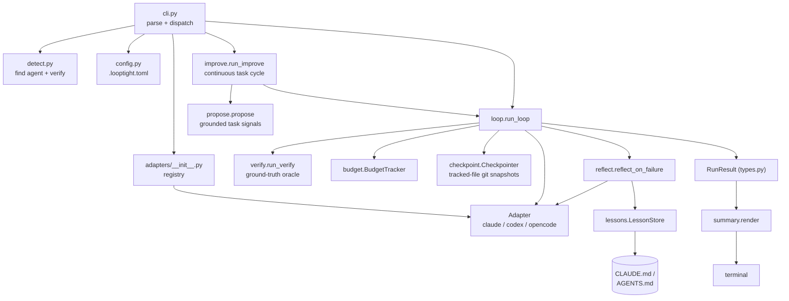
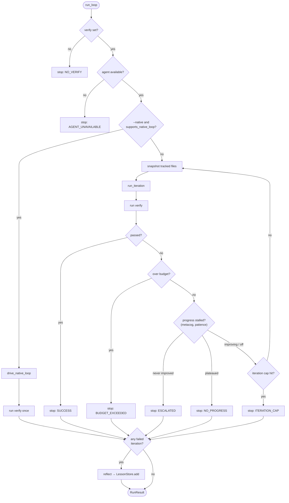
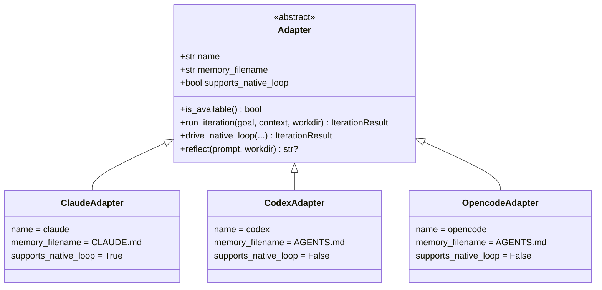
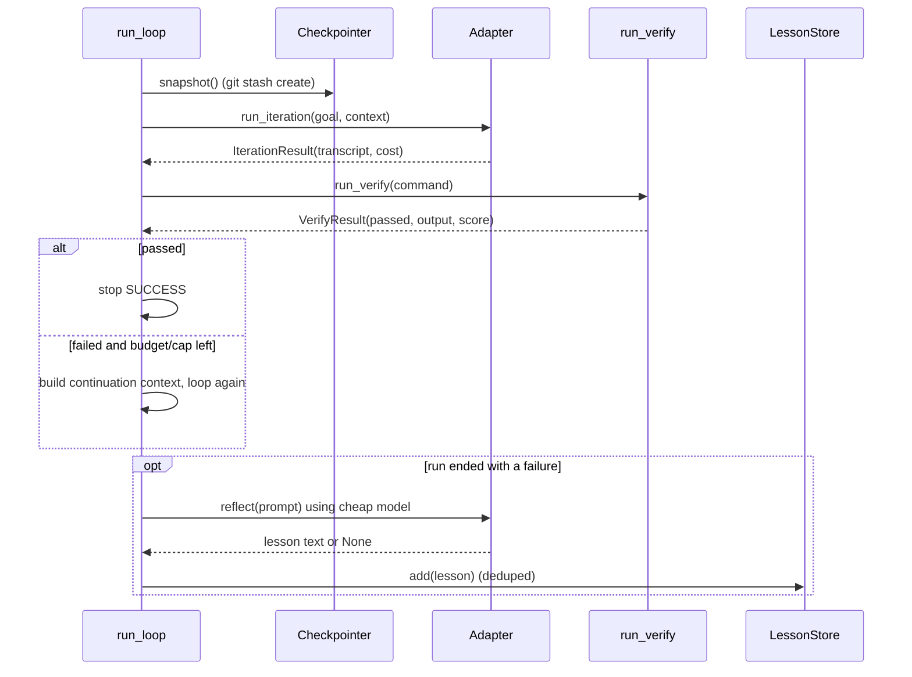

# Architecture

looptight is small on purpose. One idea (`verify`), one interface (the adapter),
and a loop that either delegates to the agent or supplies the loop itself.

## Modules at a glance

Each box is one module under `src/looptight/`. The CLI is the only entry point;
everything it touches is injected into `run_loop`, so the control flow stays pure
and testable.

`run_verify` runs in both loop paths, so `verify` is always the ground-truth
oracle and the learning layer fires whether we supplied or delegated. Everything
returns the same `RunResult` (`types.py`), so the CLI and the summary don't care
which path ran (B4).

## The loop: supply or delegate

`run_loop` checks two preconditions (a `verify` command and an available agent),
then picks a path. With `--native` and an adapter that supports it, looptight
delegates to the agent's own eval-gated loop. Otherwise it supplies the loop:
snapshot, iterate, verify, repeat, under a hard iteration cap and a
post-iteration spend threshold.
Both paths end the same way: if any iteration failed verification, reflect once
and write a lesson.

A timeout or a crashed verify command counts as a recoverable failure, not an
exception: the loop keeps its footing and lets the agent try again on the next
iteration.

## Value-aware stopping (metacog.py)

The blunt iteration cap keeps looping even when the agent stopped making
progress several turns ago, which is where tokens leak. `metacog.py` adds the
cheap half of a monitor-control loop: after each failed verify it reads a
progress signal from the output (a failing/error count, or an explicit
`SCORE:`) and decides whether another iteration is worth it. The policy is the
myopic value-of-computation approximation from resource-rational analysis
(Russell & Wefald; Lieder & Griffiths): keep going only while progress is still
improving. When it has plateaued after real progress, the loop stops and cuts
losses (`NO_PROGRESS`); when the agent never moved the needle at all, it stops
and stops with an explicit `ESCALATED` result so the blocker can be recorded and
the autonomous session can continue with another task.

It costs no extra tokens: the signal comes from output the loop already
collects, and the decision is a few comparisons. It is opt-in through
`patience` (0 = off, the legacy run-to-cap behaviour) and never tries to pick a
winning attempt from confidence, which is a known failure mode; `verify` stays
the oracle.

## The adapter is the seam (F1)

`adapters/base.py` defines one ABC. The model is a capability, not a fixed kind.
Every adapter supplies a loop iteration; some can also delegate to the agent's
own loop.

- **Every adapter supplies.** Implement `run_iteration()` (one headless turn).
  This is the universal path; all three agents have a headless one-shot mode.
- **An adapter may also delegate.** Set `supports_native_loop = True` and
  implement `drive_native_loop()` to drive the agent's own eval-gated loop. Opt
  in with `--native`. Today only Claude (`/goal`) does this.

Each adapter also names the agent's native `memory_filename` (`CLAUDE.md` /
`AGENTS.md`), which is where lessons land so they keep working when looptight
isn't running.

### Adding an agent

1. Subclass `Adapter` in `adapters/<name>.py`.
2. Set `name`, `memory_filename`, implement `is_available()` and
   `run_iteration()`. If the agent has a drivable native loop, set
   `supports_native_loop = True` and implement `drive_native_loop()`.
3. Register it in `adapters/__init__.py`.

That's the whole extension surface. Nothing else in the codebase names a
specific agent. `detect.py` holds the PATH lookup order and that's it.

## A supplied iteration, end to end

The supply path is where most runs spend their time. One iteration looks like
this:

## Testability

The loop takes its collaborators (adapter, verify fn, checkpointer, lesson
store, progress callback) as injected arguments, so `run_loop` is a pure control
flow you can drive with fakes (see `tests/conftest.py`). No test touches the
network or a real agent.

## Why no dashboard / DAG / plugin system

All three are explicit non-goals in the spec. The product's advantage is focus
plus the learning layer, not feature count. Terminal output is more gif-able and
zero-setup. The moment the surface grows past one page, the product is losing.
